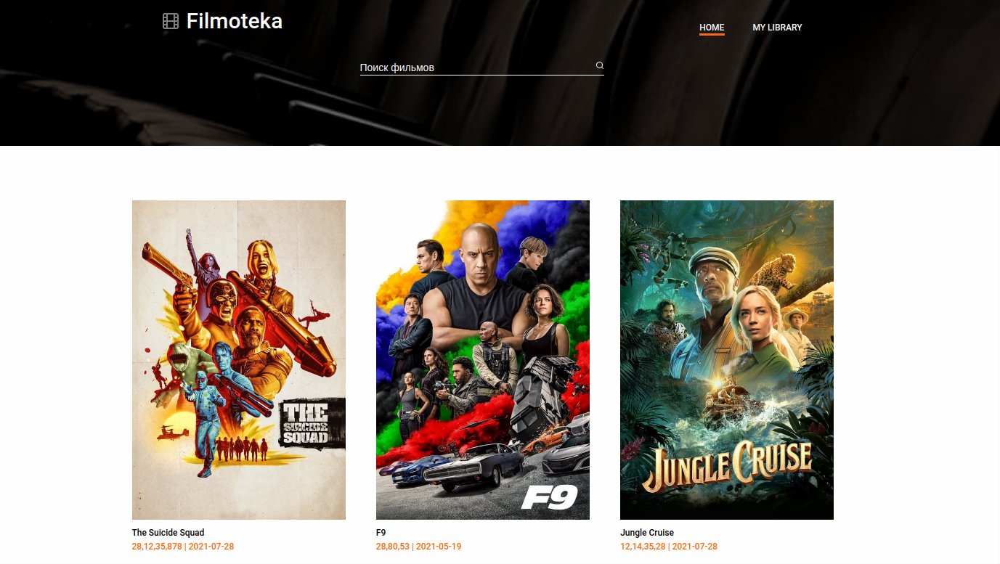

# Project "Filmoteka"

> Final project of javascript course

## Table of Contents

- [Project purpose](#project-purpose)
- [Team](#team)
- [Technologies Used](#technologies-used)
- [Features](#features)
- [Screenshots](#screenshots)
- [Conclusion](#conclusion)

## Project purpose

- The purpose of this project was to consolidate the acquired knowledge of javascript, teamwork...

## Team

- [**Team Lead:** Vitalii Morgunov](https://github.com/vmorgunov)
- [**Senior google researcher:** Ksenia Kovbasuk](https://github.com/Kseniia-FS)
- [**Scrum master** & **Front-end developer** Yaroslav Tkach](https://github.com/lamewolf)
- [**Front-end developer:** Aleksei Sobchenko](https://github.com/coreks)
- [**Front-end developer:** Max Savchuk](https://github.com/Maxim-Savchuk)
- [**Front-end developer:** Igor Kovalenko](https://github.com/ihorkovalenko27)

## Technologies Used

- HTML&CSS
- SASS
- JavaScript
- Axios
- Notiflix
- Handlebars
- Parcel
- Scrum & BEM methodologys

## Features

List the ready features here:

- Feature 1
- Feature 2
- Feature 3

## Screenshots

## Conclusion

**During the entire project we**:

- consolidated knowledge of HTML and CSS.
- practiced Git teamwork skills.
- consolidated the knowledge gained during the course in JavaScript.
- Many thanks to...
